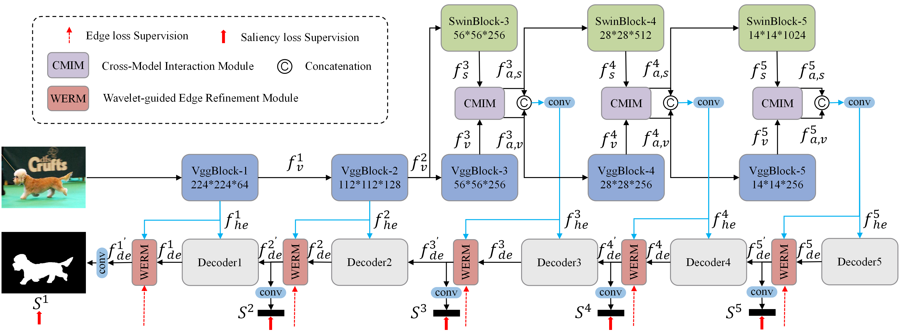

# CMIWERNet

**CMIWERNet: Salient Object Detection via Cross-Model Interaction and Wavelet-guided Edge Refinement**

This repository is reserved for the official implementation of the proposed **CMIWERNet** framework.  

> 🔧 **Note:** The code is currently undergoing an organization process and will be made available to the research community soon. Stay tuned for updates.

---

## Overview

Salient Object Detection (SOD) aims to locate salient regions in complex visual scenes and segment the most salient objects, playing a crucial role in visual measurement systems. However, it has long faced challenges such as irregular topological structures of salient objects and inaccurate boundary prediction caused by cluttered background interference. Existing methods are limited by the inherent constraints of single-model architectures or suffer from inefficient cross-model fusion during encoding. To address these issues, this paper proposes a novel Cross-Model Interaction and Wavelet-guided Edge Refinement Network (CMIWERNet). Specifically, we design a Cross-Model Interaction Module (CMIM) that achieves deep feature collaboration and information exchange during the encoding phase, allowing heterogeneous features to effectively capture both local and global contexts. This enables our model to comprehend the complete topology of salient objects. Meanwhile, a Wavelet-guided Edge Refinement Module (WERM) is introduced to extract edge cues through spatial-frequency analysis and progressively refine the decoding process, thereby suppressing interference from cluttered backgrounds and achieving accurate edge prediction. Experimental evaluations indicate that our method achieves eighteen best performances and six top-3 performances among all the twenty- four metrics in six datasets, surpassing existing solutions on six datasets and offering a more excellent SOD solution for visual measurement applications. 

---

## Network Architecture
Visual Illustration of the proposed network.

## Datasets
CMIWERNet was trained on the DUTS-TR training set and evaluated on all six test datasets. Below are the links to download each dataset:
- [DUTS](http://saliencydetection.net/duts/)  
- [DUT-OMRON](http://saliencydetection.net/dut-omron/)  
- [HKU-IS](https://i.cs.hku.hk/~gbli/deep_saliency.html)  
- [PASCAL-S](https://www.yanweifu.com/cvpr2014/)  
- [SOD](http://elderlab.yorku.ca/SOD/)  
- [ECSSD](https://www.cse.cuhk.edu.hk/leojia/projects/hsaliency/)

## Results

## Saliency Maps
We provide saliency predictions (Visual Results) generated by **CMIWERNet** on all evaluation datasets:
🔗 [Download Saliency Maps](https://pan.baidu.com/s/1Z9rlLQvO8CCtYCj3K4gVHw?pwd=mbcf)
